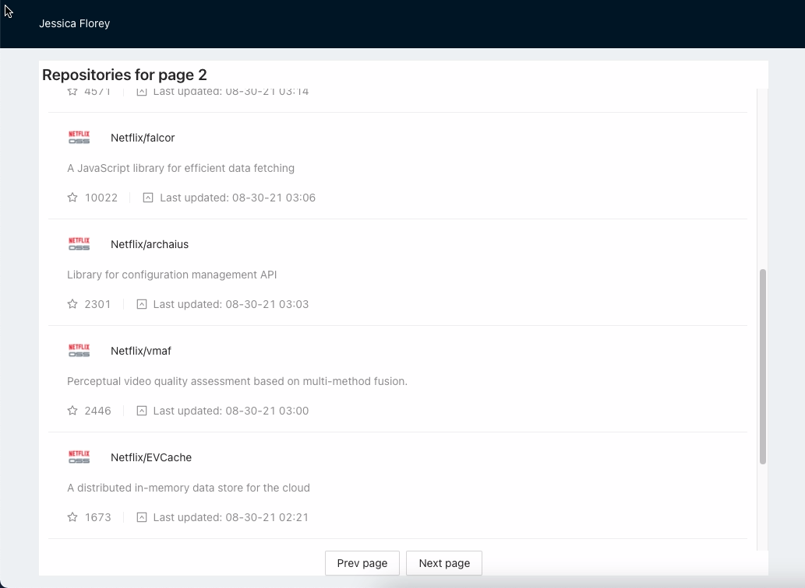
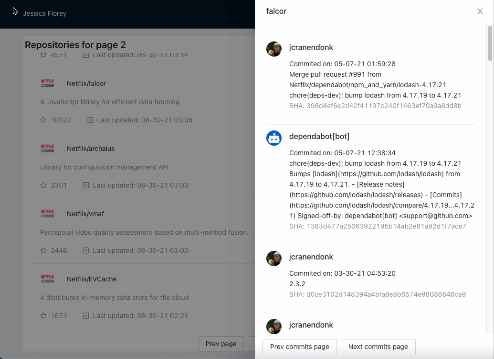

### To run the project

Install node_modules

> ``yarn install`

Start local dev

> `yarn start`

Build the project

> `yarn build`

Run automatic testing: You need to start the local dev and run this cmd:

> `./node_modules/.bin/cypress open`

### What modules are used?

- UI: Ant Design
- State management: React hook and Redux
- Other modules: axios
- Testing: Cypress

### App structure

This application just contains 1 page to list the repos, and repo 'scommits will be shown in a drawer when there is a selected repo.

List of repos, display by page, and we can navigate between pages

When a repo is selected (by clicking on the name), a drawer will be shown with its latest commits. We can also navigate pages

### Other notes:

- I display repos in the lastest updated time. The purpose is whenever visit this app, I can see what is the latest repo that's been updated.
- In every pages, there are 10 repos in a page, we can navigate by Prev/Next button, this is because we can't do the pagination (no total repos information)
- To pass the limitation rate of github api (60 requests per hour), I created a token to call the api freely.
